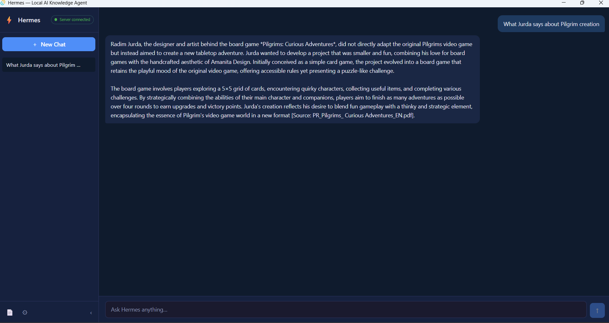
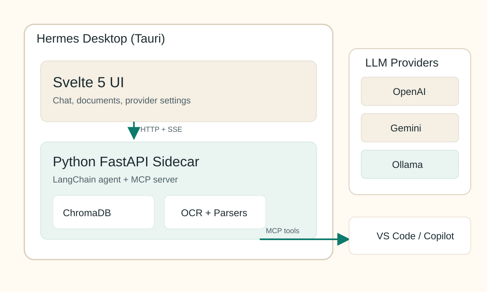

# Hermes — Local-First AI Knowledge Agent

[](https://github.com/VladYord/ProjectHermes/releases/latest)
[](https://github.com/VladYord/ProjectHermes/actions/workflows/build-release.yml)
[](LICENSE)
[](#download)

> Chat with your private documents through a packaged desktop app built with Tauri, Svelte, and a local Python backend sidecar using local or cloud LLMs — your data never leaves your machine.

---

## Screenshot



---

## Features

- **Privacy-first RAG** — Documents and vector embeddings stay entirely on your machine
- **Multi-format ingestion** — PDF, DOCX, Markdown, code files, plain text, and scanned images (OCR)
- **Pluggable LLM providers** — Ollama (local), OpenAI, and Google Gemini via your own API key
- **Streaming chat** — Token-by-token SSE responses with conversation memory across turns
- **VS Code Copilot integration** — Exposes an MCP server so Copilot can search your knowledge base
- **Native desktop app** — Tauri-powered installer for Windows, macOS, and Linux; no separate server to manage
- **Desktop-native file workflow** — Native file dialogs feed local file paths directly into the backend sidecar
- **Persistent local workspace** — Documents, sessions, and encrypted provider settings survive app restarts

---

## Download

| Platform | Installer |
|----------|-----------|
| Windows  | [Hermes_x64-setup.exe](https://github.com/VladYord/ProjectHermes/releases/latest) |
| macOS    | [Hermes_x64.dmg](https://github.com/VladYord/ProjectHermes/releases/latest) |
| Linux    | [hermes_amd64.AppImage](https://github.com/VladYord/ProjectHermes/releases/latest) |

> All releases are on the [GitHub Releases page](https://github.com/VladYord/ProjectHermes/releases).

---

## Getting Started

1. **Download and install** the installer for your platform from the table above.
2. **Open Settings** (gear icon) → enter your LLM provider API key, or point Hermes at a local Ollama instance.
3. **Run Test Connection** for the provider you want to use.
4. Hermes chats through the **Default Provider** in Settings. If a provider test succeeds and the current default provider is unavailable, Hermes automatically switches the default to the tested provider.
5. **Ingest a document** using the Documents panel, then start chatting.

### What the app actually runs

Hermes is a desktop app with three layers working together:

1. **Tauri** hosts the application window and starts the packaged backend sidecar.
2. **Svelte** renders the UI, including chat, documents, and settings.
3. **FastAPI + LangChain** serve the local REST/SSE API that powers the UI.

At startup the Python backend prints `PORT=<number>`, Tauri captures that value, and the Svelte app uses it for all local API calls.

For Ollama (free, fully local):
```bash
# Install Ollama: https://ollama.com/download
ollama pull llama3.1
```
Then in Settings → LLM Provider → select **Ollama** → `http://localhost:11434`.

---

## Architecture



```
┌──────────────────────────── Tauri Desktop App ────────────────────────────┐
│                                                                           │
│  Svelte UI (WebView)                                                      │
│    ├─ Chat window            -> POST /api/chat (SSE)                      │
│    ├─ Session sidebar        -> /api/sessions                             │
│    ├─ Document manager       -> /api/documents, /api/ingest              │
│    └─ Settings panel         -> /api/config, /api/providers              │
│                                                                           │
│  Tauri runtime                                                           │
│    ├─ starts hermes-server sidecar                                        │
│    ├─ reads stdout: PORT=XXXX                                             │
│    ├─ emits backend-ready to the UI                                       │
│    └─ kills the sidecar on exit                                           │
│                                                                           │
├──────────────────────────── Python Sidecar ───────────────────────────────┤
│  FastAPI + LangChain + ChromaDB + SQLite session memory                   │
└───────────────────────────────────────────────────────────────────────────┘
       │                                 │
       ├─ local storage                  └─ optional remote calls
       ▼                                           ▼
     ChromaDB / app data                         Ollama / OpenAI / Gemini
```

All document data and vector embeddings are stored locally in your OS app-data directory. The cloud LLM only receives your question and the retrieved text snippets — never the original file.

### Current build pipeline

The production build no longer writes the PyInstaller output directly into `src-tauri/resources`.

Instead it uses this sequence:

```text
PyInstaller -> backend/dist/hermes-server-<target>.exe
     -> copy to src-tauri/resources/
     -> cargo tauri build
```

This avoids Windows file-locking issues during Tauri sidecar bundling.

---

## Development

### Prerequisites

- Python 3.12+, Node.js 20+, Rust stable
- [Ollama](https://ollama.com) (optional — for local LLMs)
- [Tesseract OCR](https://github.com/UB-Mannheim/tesseract/wiki) (optional — for image ingestion)

### Run in dev mode

```powershell
# Terminal 1 — Python backend
.venv\Scripts\python.exe -m hermes --port 8000

# Terminal 2 — Tauri dev window (starts Vite HMR automatically)
make dev
```

`make dev` creates a dev stub binary (so Tauri compiles), then launches `cargo tauri dev`.  
The Svelte frontend connects to the running Python backend at `http://127.0.0.1:8000`.

### Main UI surfaces and backend APIs

| UI surface | Main calls |
|---|---|
| Chat window | `POST /api/chat` (streaming SSE) |
| Session sidebar | `GET /api/sessions`, `GET /api/sessions/{id}/history`, `DELETE /api/sessions/{id}` |
| Document manager | `GET /api/documents`, `POST /api/ingest`, `POST /api/ingest/upload`, `DELETE /api/documents/{id}` |
| Settings panel | `GET /api/config`, `PATCH /api/config`, `GET /api/providers`, `GET /api/health` |

### Run tests

```powershell
make test        # pytest (76 tests)
cd ui && npm run check   # svelte-check + tsc (0 errors)
```

### Production build

```powershell
make bundle-app  # PyInstaller + cargo tauri build → platform installer
```

On Windows this now builds the backend into `backend/dist`, copies it into `src-tauri/resources`, and only then runs `cargo tauri build`.

### Test the bundled result

- For a quick local smoke test, run `src-tauri\target\release\app.exe`
- For a real release test, run one installer: `src-tauri\target\release\bundle\nsis\Hermes_...-setup.exe` or the `.msi`
- Do **not** use `hermes-server.exe` as the main app; that file is the backend sidecar, not the desktop UI

See [doc/HowTo_Testing.md](doc/HowTo_Testing.md) for the short end-to-end release test flow and troubleshooting steps when the app gets stuck on `Starting backend...`.

---

## VS Code Copilot (MCP)

Hermes exposes an MCP server so GitHub Copilot can search your knowledge base directly.

Add to VS Code `settings.json`:

```json
{
  "mcp": {
    "servers": {
      "hermes": {
        "command": "C:\\path\\to\\project\\.venv\\Scripts\\python.exe",
        "args": ["-m", "hermes", "--mcp"]
      }
    }
  }
}
```

Available tools: `search_knowledge`, `ask_hermes`, `ingest_document`, `list_documents`, `remove_document`.

---

## Tech Stack

| Layer | Technology |
|-------|-----------|
| Desktop shell | [Tauri 2](https://tauri.app) (Rust) |
| Frontend | [Svelte 5](https://svelte.dev) + TypeScript + Vite |
| Backend | [FastAPI](https://fastapi.tiangolo.com) + [uvicorn](https://www.uvicorn.org) |
| AI / Agent | [LangChain](https://langchain.com) , [LiteLLM](https://www.litellm.ai/)|
| Vector store | [ChromaDB](https://www.trychroma.com) (local, persistent) |
| LLM providers | Ollama · OpenAI · Google Gemini |
| Document parsing | PyMuPDF · python-docx · Tesseract OCR |
| Packaging | PyInstaller + Tauri bundler |
| CI/CD | GitHub Actions (Windows · macOS · Linux) |

---

## License

MIT — see [LICENSE](LICENSE).
