# Project Hermes — Architecture & Design Document

> **Version:** 1.0  
> **Date:** 2026-04-01  
> **Scope:** Phase 0 + Phase 1 server implementation  
> **Purpose:** Code-review reference — maps vision requirements to implementation

---

## Table of Contents

1. [System Overview](#1-system-overview)
2. [High-Level Component Architecture](#2-high-level-component-architecture)
3. [Layer Breakdown](#3-layer-breakdown)
4. [Use Case Diagram](#4-use-case-diagram)
5. [Package & Module Structure](#5-package--module-structure)
6. [Class & Data Model Diagrams](#6-class--data-model-diagrams)
7. [Sequence Diagrams — Key Use Cases](#7-sequence-diagrams--key-use-cases)
   - 7.1 [Server Startup](#71-server-startup)
   - 7.2 [Document Ingestion (file upload via REST)](#72-document-ingestion-file-upload-via-rest)
   - 7.3 [Document Ingestion (path via REST)](#73-document-ingestion-path-via-rest)
   - 7.4 [Chat — Non-Streaming Response](#74-chat--non-streaming-response)
   - 7.5 [Chat — Streaming SSE Response](#75-chat--streaming-sse-response)
   - 7.6 [VS Code Copilot — ask_hermes (MCP)](#76-vs-code-copilot--ask_hermes-mcp)
   - 7.7 [VS Code Copilot — search_knowledge (MCP)](#77-vs-code-copilot--search_knowledge-mcp)
   - 7.8 [VS Code Copilot — ingest_document (MCP)](#78-vs-code-copilot--ingest_document-mcp)
8. [Document Processing Pipeline Detail](#8-document-processing-pipeline-detail)
9. [Authentication Flow](#9-authentication-flow)
10. [Configuration & Startup Sequence](#10-configuration--startup-sequence)
11. [State Diagrams](#11-state-diagrams)
12. [Vision-to-Implementation Traceability Matrix](#12-vision-to-implementation-traceability-matrix)
13. [Known Gaps & Phase 2 Candidates](#13-known-gaps--phase-2-candidates)

---

## 1. System Overview

Hermes is a **local-first AI knowledge agent**. Its core promise is that private documents and their vector embeddings **never leave the user's machine**. All reasoning runs locally (Ollama) or the user consciously routes through a cloud LLM with their own API key.

```
Privacy boundary = the user's local machine.
Cloud LLM (OpenAI/Gemini) only receives:
  - the user's question
  - retrieved text chunks (already the user's own data)
  - NO original documents, NO filenames unless the user asks for them
```

The Phase 0+1 deliverable is a **headless server** with three client transports:

| Transport | Protocol | Clients |
|-----------|----------|---------|
| REST API + SSE | HTTP | Local UI app, Cloud-based UI app |
| MCP stdio | JSON-RPC over stdin/stdout | VS Code Copilot |

All three transports share the **same core services** — there is no duplication of business logic.

---

## 2. High-Level Component Architecture

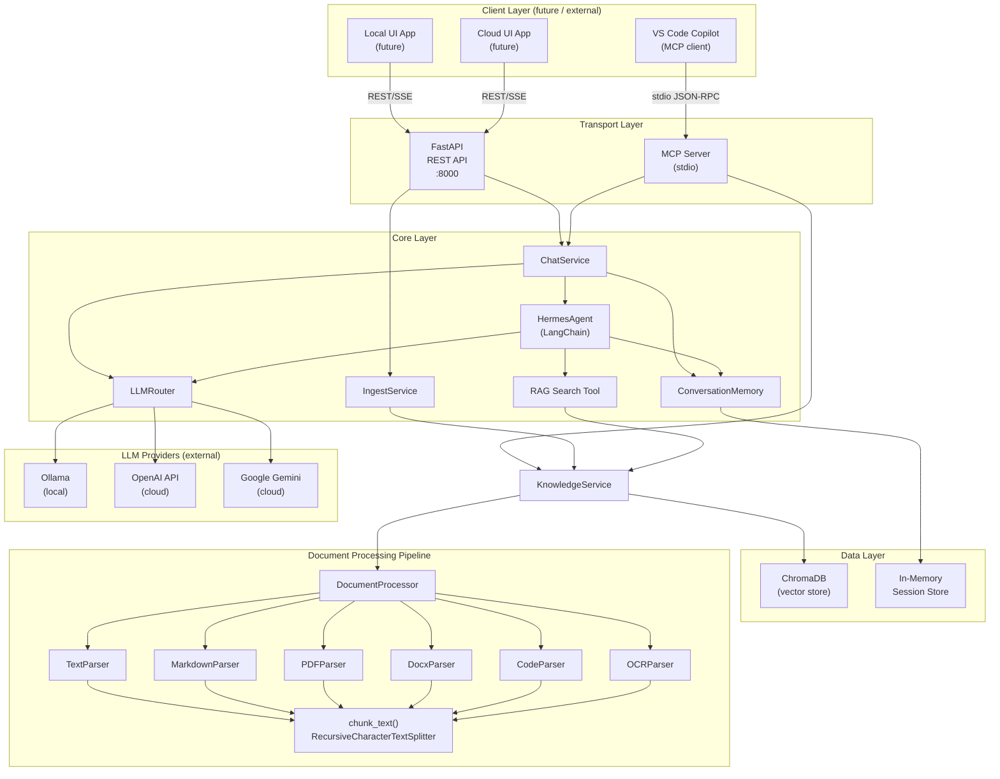

---

## 3. Layer Breakdown

### 3.1 Transport Layer

| Module | File | Role |
|--------|------|------|
| `server.py` | `hermes/server.py` | FastAPI app — REST endpoints, SSE streaming, CORS, auth middleware wiring, lifespan startup/shutdown |
| `mcp_server.py` | `hermes/mcp_server.py` | `FastMCP` server — exposes 5 tools callable by VS Code Copilot over stdio |

The two transports are **independent processes**. The user either runs:
- `python -m hermes` → HTTP server (for UI clients)
- `python -m hermes --mcp` → stdio MCP server (for VS Code)

### 3.2 Core Layer

| Module | File | Role |
|--------|------|------|
| `ChatService` | `hermes/services/chat_service.py` | Creates/caches `HermesAgent` per provider; routes `chat()` and `chat_stream()` calls |
| `IngestService` | `hermes/services/ingest_service.py` | Thin wrapper — validates file existence, delegates to `KnowledgeService` |
| `KnowledgeService` | `hermes/services/knowledge_service.py` | All vector-store operations: ingest, search, list, delete |
| `HermesAgent` | `hermes/core/agent.py` | LangChain `create_agent` graph — builds message list, invokes LLM + tools, saves to memory |
| `LLMRouter` | `hermes/core/llm_router.py` | Lazy-init & cache of provider instances (Ollama / OpenAI / Gemini) |
| `ConversationMemory` | `hermes/core/memory.py` | In-memory session map: `session_id → Session(messages[])` |
| `RAG Search Tool` | `hermes/tools/rag_search.py` | LangChain `@tool` factory that closes over `KnowledgeService` |

### 3.3 Data Layer

| Storage | Technology | Persistence |
|---------|-----------|-------------|
| Vector store | ChromaDB (embedded) | Persistent — `./data/chromadb/` |
| Conversation sessions | Python `dict` in `ConversationMemory` | In-memory only — lost on restart |

### 3.4 Document Processing Pipeline

| Module | File | Role |
|--------|------|------|
| `DocumentProcessor` | `hermes/processing/pipeline.py` | Detects type, finds parser, runs parse → chunk |
| `TextParser` | `hermes/processing/parsers/text_parser.py` | `.txt` files |
| `MarkdownParser` | `hermes/processing/parsers/markdown_parser.py` | `.md` / `.markdown` |
| `PDFParser` | `hermes/processing/parsers/pdf_parser.py` | `.pdf` via `pymupdf` |
| `DocxParser` | `hermes/processing/parsers/docx_parser.py` | `.docx` via `python-docx` |
| `CodeParser` | `hermes/processing/parsers/code_parser.py` | Source code files (14 extensions) |
| `OCRParser` | `hermes/processing/parsers/ocr_parser.py` | Images via Tesseract |
| `chunk_text()` | `hermes/processing/chunking.py` | LangChain `RecursiveCharacterTextSplitter` — 1000 char / 200 overlap |

---

## 4. Use Case Diagram

```mermaid
graph TD
    subgraph Actors
        LocalUser["👤 Local User\n(UI App)"]
        CloudUser["🌐 Remote User\n(Cloud UI App)"]
        CopilotUser["💻 Developer\n(VS Code Copilot)"]
    end

    subgraph System["Hermes Server"]
        UC1["UC1: Ingest Document\n(file upload)"]
        UC2["UC2: Ingest Document\n(by path)"]
        UC3["UC3: Chat — Ask Question\n(non-streaming)"]
        UC4["UC4: Chat — Ask Question\n(SSE streaming)"]
        UC5["UC5: List Documents"]
        UC6["UC6: Remove Document"]
        UC7["UC7: View Conversation History"]
        UC8["UC8: Clear Session"]
        UC9["UC9: List LLM Providers"]
        UC10["UC10: Health Check"]
        UC11["UC11: Search Knowledge Base\n(MCP)"]
        UC12["UC12: Ask Hermes with RAG\n(MCP)"]
        UC13["UC13: Ingest Document\n(MCP)"]
        UC14["UC14: List Documents\n(MCP)"]
        UC15["UC15: Remove Document\n(MCP)"]
    end

    LocalUser --> UC1
    LocalUser --> UC2
    LocalUser --> UC3
    LocalUser --> UC4
    LocalUser --> UC5
    LocalUser --> UC6
    LocalUser --> UC7
    LocalUser --> UC8
    LocalUser --> UC9
    LocalUser --> UC10

    CloudUser --> UC3
    CloudUser --> UC4
    CloudUser --> UC5
    CloudUser --> UC10

    CopilotUser --> UC11
    CopilotUser --> UC12
    CopilotUser --> UC13
    CopilotUser --> UC14
    CopilotUser --> UC15
```

> **Note on Cloud UI Auth:** `UC3`, `UC4`, `UC5` are available over REST to cloud clients, but all non-localhost requests require an `X-API-Key` header when `auth.enabled = true` in `config.yaml`.

---

## 5. Package & Module Structure

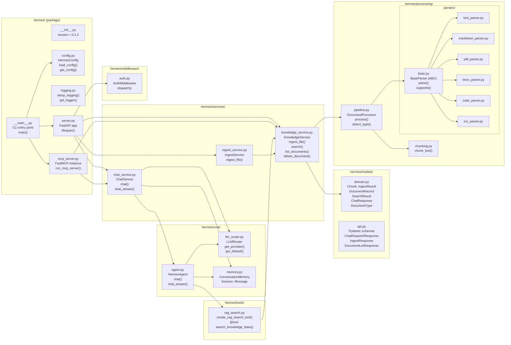

---

## 6. Class & Data Model Diagrams

### 6.1 Domain Models

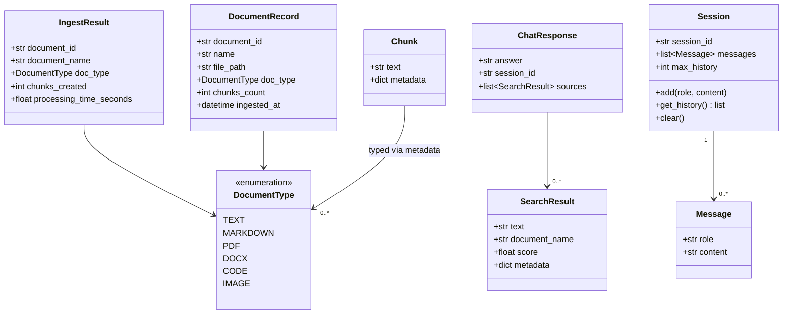

### 6.2 Service & Core Classes

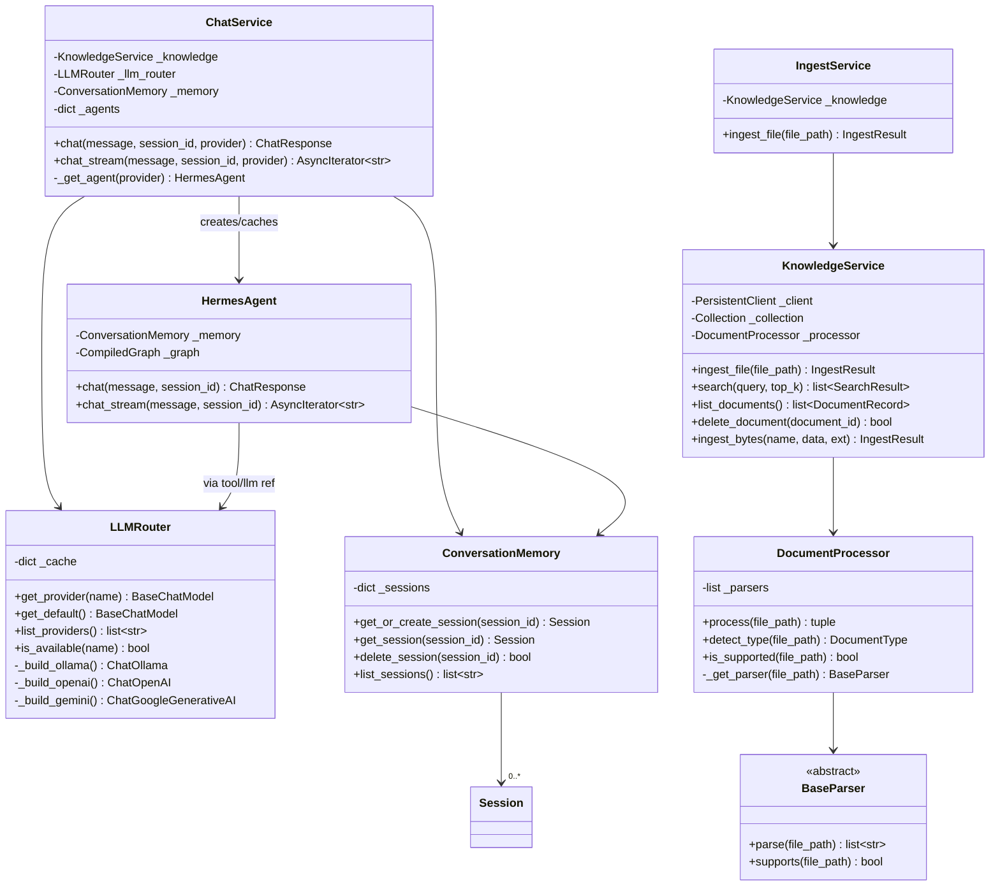

### 6.3 API Schema Models (Pydantic)

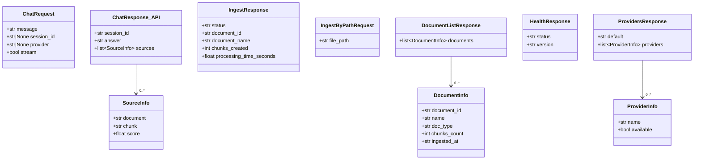

---

## 7. Sequence Diagrams — Key Use Cases

### 7.1 Server Startup

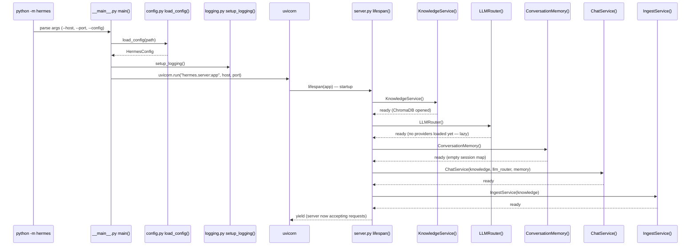

### 7.2 Document Ingestion (file upload via REST)

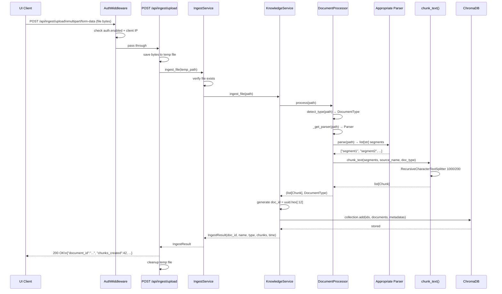

### 7.3 Document Ingestion (path via REST)

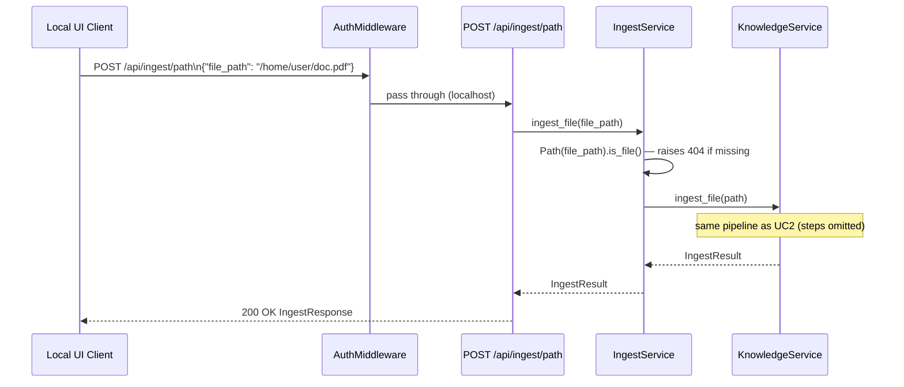

> **Security note:** Path-by-path ingestion is intended for localhost clients only. The `AuthMiddleware` does not apply extra restrictions to paths — the operator should only expose port 8000 to trusted networks.

### 7.4 Chat — Non-Streaming Response

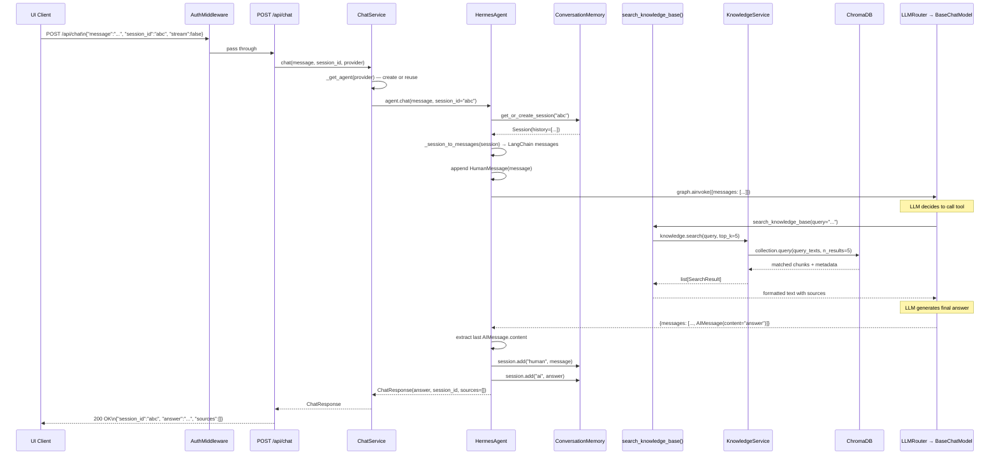

### 7.5 Chat — Streaming SSE Response

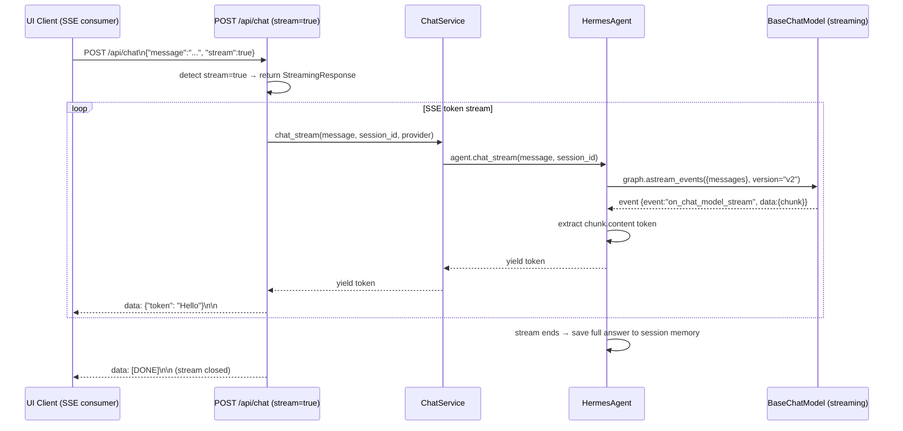

> SSE format: each event is `data: {"token": "..."}` followed by `\n\n`. The client reconnects automatically if the connection drops (SSE protocol).

### 7.6 VS Code Copilot — `ask_hermes` (MCP)

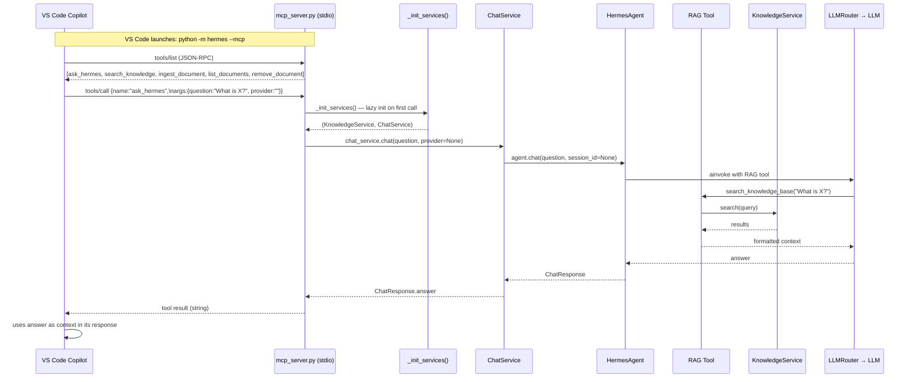

> **MCP transport:** VS Code spawns Hermes as a **child process**. All communication is over stdin/stdout as JSON-RPC messages. No network port is used. Services are lazily initialized on the first tool call.

### 7.7 VS Code Copilot — `search_knowledge` (MCP)

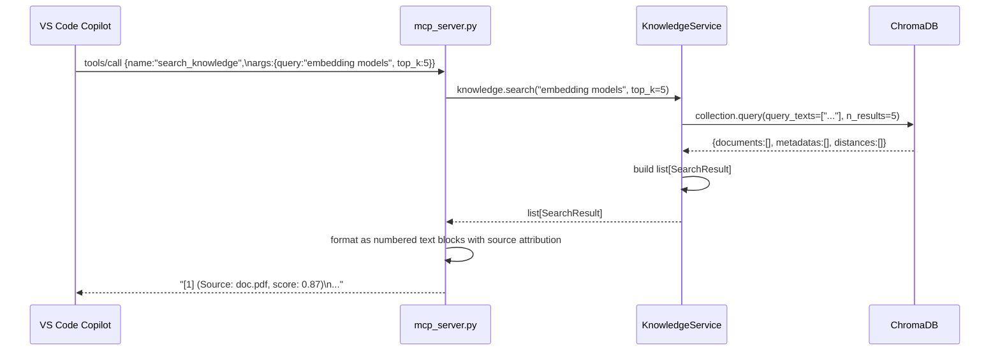

> **Difference from `ask_hermes`:** `search_knowledge` returns raw retrieved passages. No LLM is called. This is useful when the developer wants to verify what's in the knowledge base, or wants to compose their own prompt in Copilot.

### 7.8 VS Code Copilot — `ingest_document` (MCP)

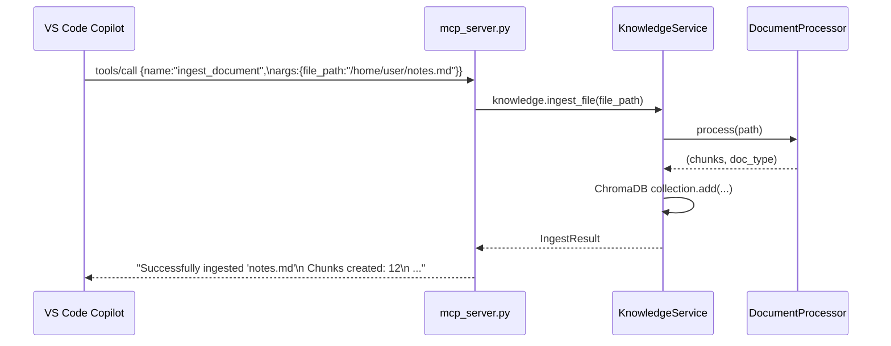

---

## 8. Document Processing Pipeline Detail

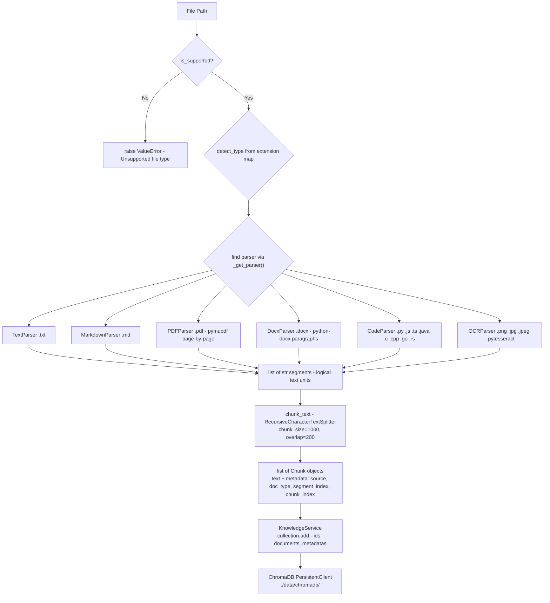

### 8.1 Embedding Strategy

The current implementation uses a **`_HashEmbeddingFunction`** (SHA-256 hash → 384-dimensional float vector). This is a **non-semantic fallback** that avoids requiring model downloads in offline/corporate environments.

```
For real semantic search (recommended for production):
  Option A: OllamaEmbeddingFunction (local, no cost)
            model: "nomic-embed-text" (set in config.yaml → vectordb.embedding_model)
  Option B: OpenAIEmbeddingFunction (cloud, cost per token)
  
This is a Phase 2 upgrade — pass the embedding function to KnowledgeService(embedding_fn=...).
```

---

## 9. Authentication Flow

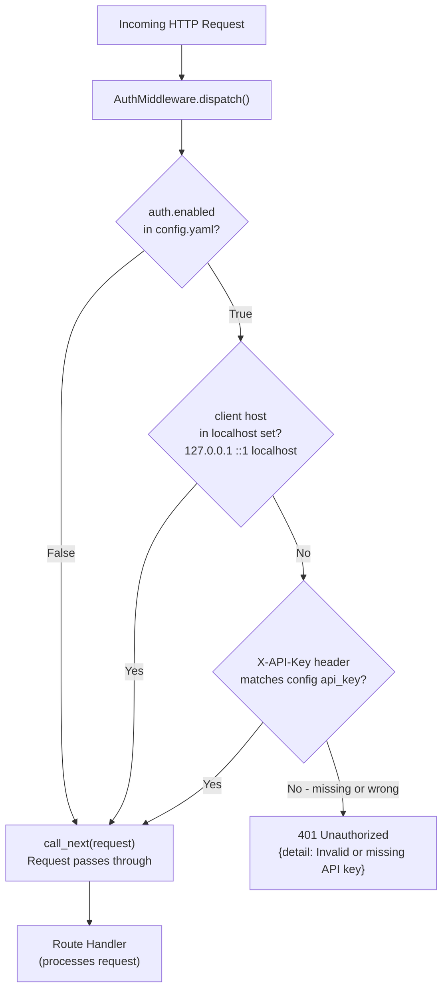

**Default state:** `auth.enabled = false` — all requests pass through. Set `auth.enabled = true` and `auth.api_key = <secret>` in `config.yaml` (or via `${HERMES_API_KEY}` env var) to protect cloud-accessible deployments.

---

## 10. Configuration & Startup Sequence

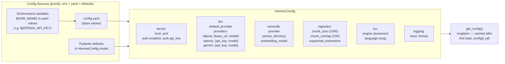

---

## 11. State Diagrams

### 11.1 Session State

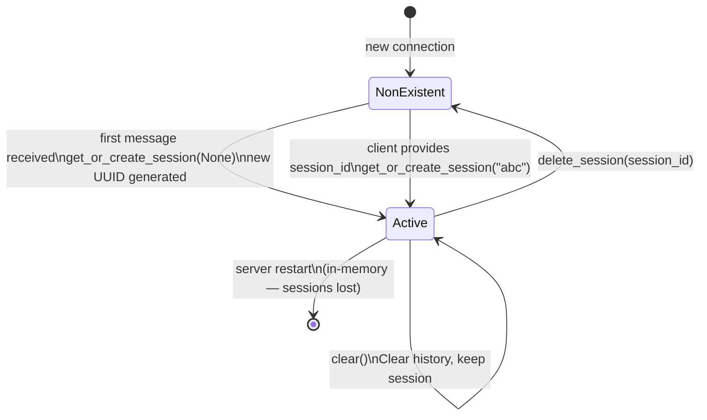

### 11.2 Document Lifecycle

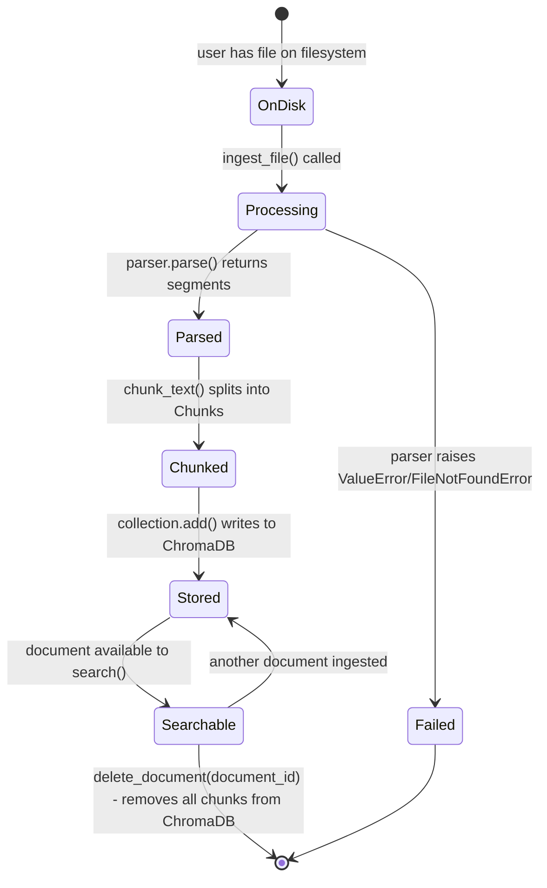

### 11.3 LLM Provider State (LLMRouter)

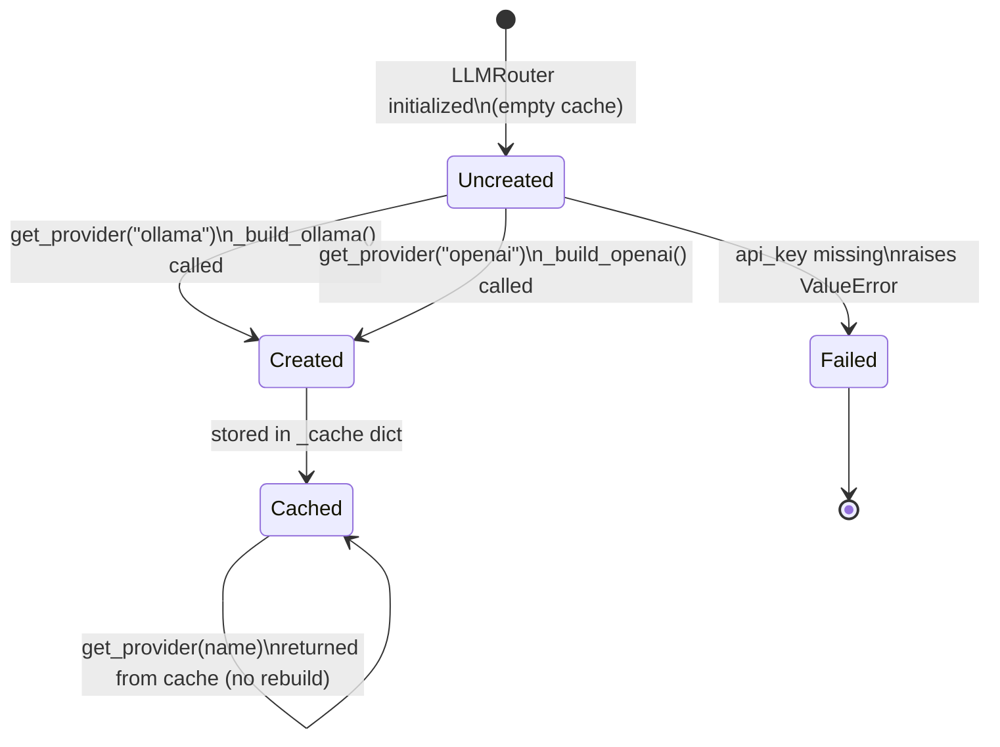

---

## 12. Vision-to-Implementation Traceability Matrix

### 12.1 Functional Requirements

| Req ID | Requirement (from Vision.md) | Status | Implementation |
|--------|------------------------------|--------|----------------|
| FR1 | Web-based UI with chat window | 🟡 Deferred | Server exposes REST API + SSE; UI is Phase 2 (intentional — spec says UI deferred) |
| FR2 | Mechanism to ingest a local PDF file | ✅ Done | `POST /api/ingest/upload` (file bytes), `POST /api/ingest/path` (local path), MCP `ingest_document` |
| FR3 | Backend receives user messages from frontend | ✅ Done | `POST /api/chat` (`ChatRequest.message`); MCP `ask_hermes(question)` |
| FR4 | Agent uses RAG tool to search vector DB | ✅ Done | `HermesAgent` + `create_rag_search_tool()` — LangChain tool calls `KnowledgeService.search()` |
| FR5 | Agent calls cloud LLM with question + context | ✅ Done | `LLMRouter` supports OpenAI, Gemini (cloud); Ollama (local); switched per request |
| FR6 | Frontend displays AI response | 🟡 Deferred | `ChatResponse` returned; SSE streaming supported; UI is Phase 2 |

### 12.2 Non-Functional Requirements

| Req ID | Requirement | Status | Implementation |
|--------|-------------|--------|----------------|
| NFR1 | Documents never transmitted outside local machine | ✅ Done | ChromaDB persists locally (`./data/chromadb/`). Cloud LLMs only receive text chunks. No file upload to cloud. |
| NFR2 | Response time < 10s | 🟡 Depends on LLM | Hash embeddings: ~1ms. Chunking 100-page PDF: ~2-3s. LLM response: depends on provider/model. Architecture adds <100ms overhead. |
| NFR3 | Clean, simple, intuitive UI | 🟡 Deferred | Phase 2 |
| NFR4 | Modular backend — separate API, agent logic, tools | ✅ Done | Clear layer separation: `server.py` (transport) → `services/` (orchestration) → `core/` (logic) → `tools/` (tool definitions) → `processing/` (data) |

### 12.3 Extended Requirements (from Phase 0+1 Plan)

| Requirement | Status | Implementation |
|-------------|--------|----------------|
| Multi-format ingestion (PDF, TXT, MD, DOCX, Code, Images) | ✅ Done | 6 parsers in `hermes/processing/parsers/` |
| Pluggable LLM providers | ✅ Done | `LLMRouter` — Ollama, OpenAI, Gemini |
| SSE streaming | ✅ Done | `chat_stream()` → `astream_events()` → `StreamingResponse` |
| MCP server for VS Code Copilot | ✅ Done | `hermes/mcp_server.py` — 5 tools |
| Conversation memory | ✅ Done | `ConversationMemory` — in-memory, 20-message window |
| Auth middleware | ✅ Done | `AuthMiddleware` — API key, localhost bypass, disabled by default |
| Config with env var expansion | ✅ Done | `${VAR}` in `config.yaml` replaced from environment |
| OCR for scanned images | ✅ Done | `OCRParser` (requires Tesseract to be installed) |
| Test coverage | ✅ Done | 70 unit + integration tests |

### 12.4 What Exceeded the Original Vision

| Addition | Rationale |
|----------|-----------|
| MCP server (VS Code Copilot) | Not in original Vision but requested pre-implementation |
| Three LLM providers (Ollama + OpenAI + Gemini) | Vision had one; added modularity |
| SSE token streaming | Vision assumed full response; streaming improves UX |
| 6 document types vs 1 (PDF only) | Vision said single PDF; Plan extended this |
| Code file parsing | Added proactively for developer use case |
| Auth middleware | Not in Vision; added for cloud UI access safety |
| 70 automated tests | Vision had informal testing |

---

## 13. Known Gaps & Phase 2 Candidates

| Gap | Severity | Notes |
|-----|----------|-------|
| **Embedding quality** — hash-based embeddings give no real semantic similarity | High | Upgrade to `OllamaEmbeddingFunction("nomic-embed-text")` in `KnowledgeService.__init__` |
| **Conversation sessions not persisted** — lost on restart | Medium | Store sessions in SQLite or ChromaDB metadata |
| **No document metadata store** — `list_documents()` reconstructs from ChromaDB | Medium | Add a lightweight SQLite/JSON document registry |
| **No web UI** (FR1, FR6) | High for end users | Phase 2 — Next.js or React client |
| **No WebSocket support** — only SSE for streaming | Low | SSE is sufficient for unidirectional streaming; WS adds complexity |
| **No rate limiting or abuse protection** | Medium | Add FastAPI middleware or use reverse proxy (nginx) |
| **SingleUser only** — no multi-user session isolation | Low | Personal tool; adequate for PoC |
| **Agent has no tools beyond RAG** | Medium | Phase 2: web search, calendar, file system tool |
| **Ollama connectivity check** — `is_available()` only checks object creation | Low | Add a real ping check to Ollama health endpoint |
| **Upload size limit** — no max file size enforced on `POST /api/ingest/upload` | Medium | Add `UploadFile` size validation |
| **No document deduplication** — ingesting same file twice creates duplicate chunks | Medium | Hash file content on ingest; skip if already stored |

---

## Appendix A — REST API Summary

| Method | Path | Description |
|--------|------|-------------|
| `GET` | `/api/health` | Health check |
| `GET` | `/api/providers` | List LLM providers and availability |
| `POST` | `/api/chat` | Send message; `stream:false` → full response; `stream:true` → SSE |
| `POST` | `/api/ingest/upload` | Ingest multipart file upload |
| `POST` | `/api/ingest/path` | Ingest local file by path |
| `GET` | `/api/documents` | List all ingested documents |
| `DELETE` | `/api/documents/{document_id}` | Remove document from knowledge base |
| `GET` | `/api/sessions/{session_id}` | Get conversation history for session |
| `DELETE` | `/api/sessions/{session_id}` | Delete a session |

## Appendix B — MCP Tools Summary

| Tool | Sync/Async | Description |
|------|-----------|-------------|
| `search_knowledge` | sync | Raw vector search — returns top-k passages, no LLM |
| `ask_hermes` | async | Full RAG pipeline — search + LLM reasoning |
| `ingest_document` | sync | Ingest a file by local path |
| `list_documents` | sync | List all documents in knowledge base |
| `remove_document` | sync | Remove a document by ID |

## Appendix C — Entry Points

```bash
# REST API server (default, for UI clients)
python -m hermes
python -m hermes --host 0.0.0.0 --port 8000 --config /path/to/config.yaml

# MCP server (for VS Code Copilot — spawned by VS Code)
python -m hermes --mcp

# VS Code settings.json MCP entry
{
  "mcp": {
    "servers": {
      "hermes": {
        "type": "stdio",
        "command": "python",
        "args": ["-m", "hermes", "--mcp"],
        "cwd": "C:/Project Hermes"
      }
    }
  }
}
```


🧠 **1. CORE GOAL: ARCHITECTING AI AGENTS**
   ┃
   ┣━━🤖 **2. The AI Agent (The Entity)**
   ┃   ┣━ **Definition:** An autonomous system that can perceive, reason, plan, and act to achieve goals.
   ┃   ┗━ **Core Process: The Agentic Loop**
   ┃       ┣━ **Observe:** Gathers information about its environment.
   ┃       ┣━ **Think:** Reasons about a plan to achieve its goal. (This is where the LLM shines).
   ┃       ┣━ **Act:** Executes a plan by using tools (e.g., calling an API, running code, or using RAG).
   ┃       ┗━ **Repeat:** Uses the result of the action to observe again and continue the loop.
   ┃
   ┣━━💡 **3. The LLM (The "Brain")**
   ┃   ┣━ **Role:** The central reasoning and language engine.
   ┃   ┗━ **Inherent Limitations (The "Why"):**
   ┃       ┣━ ❌ **Knowledge Cutoff:** Knowledge is frozen at the time of training.
   ┃       ┗━ ❌ **Hallucination:** Invents plausible but incorrect facts when it doesn't know an answer.
   ┃
   ┣━━📚 **4. Retrieval-Augmented Generation (RAG) (The "External Knowledge")**
   ┃   ┣━ **Purpose:** To solve the LLM's limitations by connecting it to real-time, factual, or private data.
   ┃   ┣━ **Process Flow:**
   ┃   ┃   ┣━ **[A] Retrieval Phase:** Find relevant information.
   ┃   ┃   ┗━ **[B] Generation Phase:** Use that information to generate an answer.
   ┃   ┃
   ┃   ┗━ **Deep Dive: [A] The Retrieval Phase & Vector Search**
   ┃       ┣━ **Goal:** Find data based on semantic meaning, not just keywords.
   ┃       ┃
   ┃       ┣━ **(Offline) Step 1: INDEXING**
   ┃       ┃   ┣━ **Chunking:** Break down large documents into smaller, meaningful pieces.
   ┃       ┃   ┣━ **Embedding:** Use an **Embedding Model** to convert each text chunk into a numerical vector.
   ┃       ┃   ┗━ **Storing:** Store these vectors in a specialized **Vector Database**.
   ┃       ┃
   ┃       ┗━ **(Real-Time) Step 2: QUERYING**
   ┃           ┣━ **Embed Query:** Convert the user's question into a vector with the same model.
   ┃           ┣━ **Vector Similarity Search:** Find the "closest" document vectors to the query vector.
   ┃           ┃   ┣━ **How?** Using **Similarity Metrics** (e.g., Cosine Similarity, Euclidean Distance).
   ┃           ┃   ┗━ **How to make it fast?** Using **Approximate Nearest Neighbor (ANN)** algorithms (e.g., HNSW).
   ┃           ┗━ **Retrieve:** Pull the original text chunks corresponding to the closest vectors.
   ┃
   ┗━━ dirigir **5. Context Engineering (The "Director")**
       ┣━ **Definition:** The discipline of managing all information fed into the LLM's "context window."
       ┗━ **What's in the Context Window?**
           ┣━ **System Prompt:** The agent's identity, rules, and persona.
           ┣━ **User Query:** The immediate question from the user.
           ┣━ **Retrieved Data (from RAG):** The factual information needed to answer the query.
           ┣━ **Chat History:** The memory of the current conversation.
           ┗━ **Tool Definitions:** Descriptions of the tools the agent can use.
