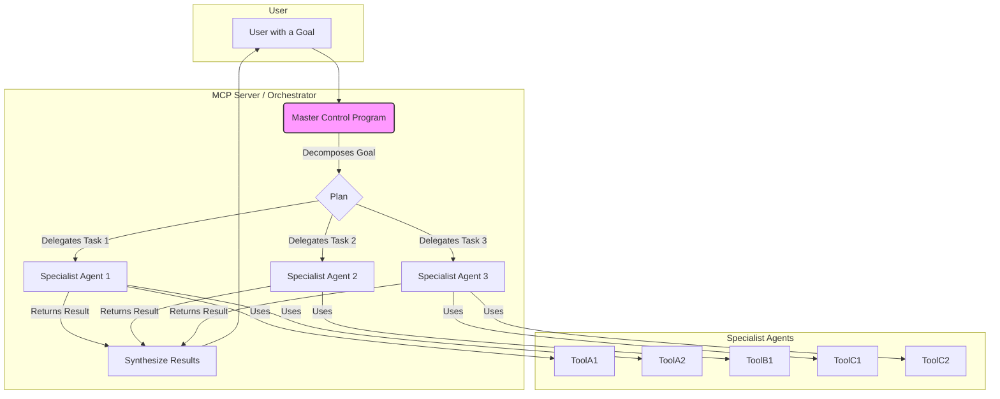

Designing an effective Model-Context-Protocol (MCP) is crucial for building robust, scalable, and maintainable AI agentic systems. An MCP governs how context is managed and presented to an AI model, acting as the "brain" that decides what information the model needs to see at any given moment.

Here are the best practices for designing an effective MCP, synthesized from industry experts and real-world implementations.

### 1. Architectural Principles: Keep it Lightweight and Modular

The most critical principle is to treat your MCP as a **lightweight bridge or conductor, not a container for business logic**. Its primary job is to route requests and coordinate communication, not to perform the actions itself.

*   **Single-Responsibility Agents**: Design agents that are responsible for a single, well-defined task. Overloading a single agent with multiple tools or responsibilities increases prompt complexity, reduces reliability, and makes the system harder to debug and scale.
*   **Microservices for Tools**: Encapsulate each tool or capability within its own microservice. The MCP should call these services to get results. This decouples the logic, making the system more scalable, maintainable, and easier to understand.
*   **Clear Separation of Concerns**: Maintain a clean separation between the agentic workflow logic and the MCP server. The workflow engine should handle the business logic, while the MCP server acts as a thin adapter that exposes workflow endpoints as tools. This separation improves maintainability and allows for independent scaling.

### 2. Context Management: Be Intentional and Efficient

Effective context engineering is about providing the AI with the right information at the right time, without overwhelming its limited context window.

*   **Just-in-Time Context Retrieval**: Instead of loading all possible data upfront, agents should dynamically load data into context at runtime using tools. This mirrors human cognition, where we retrieve information on demand rather than memorizing everything.
*   **Memory Management**: Implement both short-term and long-term memory solutions.
    *   **Short-Term Memory**: Use for information within a single session to maintain context.
    *   **Long-Term Memory**: Persist key facts, user preferences, and summaries of past interactions across sessions using vector databases or knowledge graphs. This allows agents to learn and adapt over time.
*   **Context Compaction and Summarization**: To manage long-running tasks that exceed the context window, use techniques like summarization to condense conversation history or large documents. This distills the essential information, enabling the agent to maintain coherence with minimal performance degradation. Be cautious, as overly aggressive summarization can lead to the loss of critical details.
*   **Pruning and Trimming**: Remove irrelevant or low-value content from the context, such as verbose tool call logs or older, less relevant messages.

### 3. Tool and Agent Design: Promote Clarity and Determinism

The way you design your agents' tools and prompts directly impacts the system's reliability.

*   **Use Direct Function Calls Over Tool Calls for Deterministic Tasks**: For operations that do not require language-based reasoning (e.g., database writes, API posts), use direct, "pure" function calls from the orchestration layer instead of LLM-driven tool calls. This eliminates ambiguity, reduces token usage, and increases stability.
*   **One Agent, One Tool**: Whenever possible, assign a single, well-defined tool to each agent. This simplifies prompting and eliminates the "tool selection noise" that can lead to errors.
*   **Externalize Prompts**: Store prompts in external files (e.g., Markdown in a Git repository) and load them at runtime. This decouples the agent's logic from the application code, allowing for easier updates, version control, and collaboration with non-technical stakeholders.
*   **Employ a Multi-Model Consortium**: To mitigate the biases and hallucinations of a single model, use a "consortium" of different LLMs. A dedicated reasoning agent can then synthesize their outputs, improving accuracy and aligning with Responsible AI principles.

### 4. Orchestration and Workflow: Build for Resilience and Scalability

The orchestration pattern you choose will define how your agents collaborate. Common patterns include:

*   **The Assembly Line (Sequential Flow)**: Best for well-defined, step-by-step processes where agents work in sequence.
*   **The Orchestrator (Hub-and-Spoke)**: A central "manager" agent delegates tasks to specialized "worker" agents and synthesizes their outputs. This is ideal for tasks that can be broken down into independent sub-tasks.
*   **The Collaborative Team (Peer-to-Peer)**: Agents communicate freely to debate ideas and iteratively improve solutions. This is best for open-ended, creative problems but can be complex and costly.

When implementing orchestration, use frameworks like **LangGraph** or **CrewAI** that support composability, extensibility, and tool integration.

### 5. Observability and Deployment: Ensure Production-Readiness

To operate agentic systems reliably in production, you need robust observability and deployment practices.

*   **Instrument for Observability**: Use standards like **OpenTelemetry** to instrument your agents. This allows you to trace the execution flow, track key metrics (latency, token usage, error rates), and log detailed events for debugging. Observability is crucial for identifying bottlenecks, managing costs, and ensuring compliance.
*   **Human-in-the-Loop (HITL)**: For sensitive or high-impact actions, build in human approval steps. An agent should propose an action and then pause, waiting for a human to approve or reject it before proceeding. This is a critical safety and accountability measure.
*   **Containerized Deployment**: Deploy your workflow and MCP server using containers (e.g., Docker) orchestrated by a platform like Kubernetes. This provides portability, scalability, resilience, and security for your production environment.

By adhering to these best practices, you can design and build a Model-Context-Protocol that enables a robust, scalable, and effective AI agentic system.

-------------------------------------------------------------------------------------------------------------------------------------------------------------------

Can I relate MCP server as a way to implement an AI Agent. Explain and relate : What are the ways to implement an AI Agent and what is MCP Server best used for ? Can i say that a MCP Server provide multiple Agents. Or Agent can use multiple MCP Servers. What is relation there. Which is the higer layer whcih orchestrate that ?

Response complete
Gemini replied
Excellent questions! You're moving from the concept of a single agent's "Skill" to the much broader and more complex topic of how entire systems of agents are architected and orchestrated. Using the "MCP Server" analogy is a fantastic way to frame this discussion.

Let's break it down.

Can I relate an MCP Server to implementing an AI Agent?
Yes, absolutely. The concept of a "Master Control Program" (MCP), famously from the movie Tron, is a perfect analogy for a specific, powerful architecture for implementing AI systems: a centralized, multi-agent orchestrator.

In this model, the MCP Server isn't just one agent; it's the master conductor of a whole orchestra of specialized agents. It's the central hub that receives user goals, breaks them down, and delegates the work to the right subordinate agent for the job.

What are the ways to implement an AI Agent?
There are several common architectural patterns for building AI agents, ranging from simple to highly complex. The MCP model is one of the more advanced patterns.

Implementation Method	Description	Analogy	When to Use It
1. Monolithic Agent	A single, self-contained application where the reasoning, memory, and tools are all bundled together.	A Swiss Army Knife. It has multiple tools, but it's one single object.	Simple, single-purpose agents or initial prototypes. Quick to build but hard to scale or maintain.
2. Framework-Based Agent	Using a library like LangChain, LlamaIndex, or Semantic Kernel to structure the agent. The framework provides the "chassis" for the agent's core loop (reasoning, tool use, etc.).	A car manufacturing platform. The framework gives you the engine, chassis, and wiring, and you build the car body and features on top.	Most common approach today. Provides a good balance of structure and flexibility for building sophisticated single agents.
3. Microservices Agent	The agent's core functions (e.g., memory, tool execution, perception) are broken out into separate, independently deployable services that communicate over a network.	A modern web application. The front-end, back-end, and database are all separate services.	Complex, high-traffic enterprise systems where scalability and fault tolerance are critical.
4. Multi-Agent System (The MCP Model)	A system composed of multiple, independent agents that collaborate to solve a problem. This is where the MCP Server fits in. It's a central orchestrator that manages a fleet of specialized "worker" agents.	A corporate hierarchy. The CEO (MCP) gets a high-level goal, breaks it down, and delegates tasks to the VPs of different departments (specialist agents).	Highly complex problems that require diverse expertise, parallel processing, or simulating complex systems (e.g., market dynamics, team workflows).
 
What is an MCP Server Best Used For?
An MCP Server architecture excels at complex task decomposition and delegation. It's best used when a user's request is too broad or multifaceted for a single agent to handle efficiently.

Its primary roles are:

Central Intake: Acts as the single point of contact for all incoming user requests.

Strategic Planning: Analyzes the user's goal and determines the sequence of steps and the types of expertise needed.

Task Routing & Delegation: Assigns sub-tasks to the appropriate specialized agent (e.g., "Analyze this data" goes to the DataAnalysisAgent, "Draft an email" goes to the CommunicationsAgent).

Inter-Agent Communication: Acts as a message bus or switchboard, allowing the specialist agents to coordinate and share information if necessary.

Result Synthesis: Collects the outputs from all the worker agents and synthesizes them into a single, cohesive final answer for the user.

What is the relationship between Agents and MCP Servers?
This is the crucial part of your question. There are two primary relationships:

An MCP Server provides multiple Agents.
This is the most common interpretation. The MCP Server is the environment or platform that hosts and manages a fleet of specialized agents. You interact with the MCP, and it, in turn, uses its subordinate agents to fulfill your request. You might never even interact with the individual agents directly.

Example: You ask an MCP, "Analyze our Q4 sales data and create a presentation for the board."

The MCP delegates "analyze sales data" to the SQLQueryAgent.

It then sends the results to the DataVisualizationAgent to create charts.

Finally, it passes the charts and analysis to the PresentationAgent to build the slideshow.

An Agent can use multiple MCP Servers.
This is less common but conceptually possible in a decentralized or federated system. In this scenario, a high-level autonomous agent might need to accomplish a goal that requires accessing different, independent ecosystems.

Example: A CorporateStrategyAgent's goal is to "Plan our market entry into Germany."

It might first query the company's internal "ProjectMCP" to get data on existing product lines.

Then, it might access an external, third-party "MarketIntelMCP" to get German market analysis data.

The CorporateStrategyAgent is the top-level actor, and the MCPs are powerful, domain-specific tools it uses.

The Orchestration Layer: Which is Higher?
In the primary model (MCP provides Agents), the MCP Server is the highest orchestration layer.

It sits above the specialized agents and is responsible for the "macro" orchestration—the high-level plan. Each specialized agent might have its own internal "micro" orchestration loop (how it decides which of its own tools to use), but the MCP manages the overall workflow across all agents.

Here is the hierarchy:

So, to summarize: thinking of an MCP Server as a central orchestrator for a multi-agent system is a very accurate and powerful mental model for understanding modern, sophisticated AI implementations.

---------------------------------------------------------------------------------------

Of course! Let's break down the concepts of Skills, Tools, and other modules within the architecture of AI Agents.

### What is a Skill in AI Agents?

A **Skill** is a comprehensive, reusable package of knowledge and procedures that teaches an AI agent *how* to perform a complex, domain-specific task. Think of it not as a single action, but as a complete recipe or a standard operating procedure (SOP) the agent can follow.

A Skill typically bundles together:
*   **Instructions:** Detailed, prompt-driven instructions in a file (like `SKILL.md`) that guide the agent's reasoning and workflow.
*   **Reference Documents:** Additional knowledge files (e.g., brand guidelines, technical documentation, glossaries) that the agent can consult on-demand.
*   **Scripts or Tools:** The specific tools or executable code the agent needs to perform the task.

This structure allows skills to be portable and version-controlled, enabling different teams to develop and maintain specialized capabilities for agents independently.

---
### How Skills Differ from Tools

The primary difference between a Skill and a Tool is their level of abstraction. A tool is a specific function, whereas a skill is the knowledge of how and when to use one or more tools to achieve a goal.

| Feature | Tool | Skill |
| :--- | :--- | :--- |
| **Definition** | A single, deterministic function or API that an agent can call to perform a specific action (e.g., `search_web()`, `get_weather()`). | A high-level package of instructions, knowledge, and tools that teaches an agent a complete workflow (e.g., a "deploy-application" skill). |
| **Granularity** | Low-level and specific. Represents a single "verb" or capability. | High-level and comprehensive. Represents a full "recipe" or process. |
| **Composition** | A discrete unit of action. | A combination of instructions, reference data, and one or more tools. |
| **Example** | `gdrive.getDocument()` is a tool that retrieves a file. | A "Marketing Analytics" skill uses a Python script (a tool) to analyze a CSV file and a reference document (another tool) for metric definitions to create a full report. |

In short, an agent **uses Tools** by following the instructions provided in a **Skill**.

---
### Use Cases and Benefits of Skills

The primary purpose of using Skills is to extend an agent's capabilities with specialized, reliable, and efficient expertise.

#### Key Uses:
*   **Domain Expertise:** Packaging knowledge for specific fields like legal document review, medical data analysis, or financial reporting.
*   **Repeatable Workflows:** Turning complex, multi-step tasks like deploying code, generating A/B tests, or converting a series of tweets into a newsletter into consistent, auditable processes.
*   **Interoperability:** Creating a capability once and deploying it across different AI agents and platforms that support the open "Agent Skills" standard.

#### Key Benefits:
*   **Improved Accuracy:** By providing specific instructions and reference data, Skills reduce the chance of AI "hallucination" and ensure tasks are performed correctly.
*   **Context Efficiency:** Skills employ "progressive disclosure," loading knowledge into the AI's context only when needed. This avoids "context rot"—a problem where providing too much information upfront degrades the AI's performance.
*   **Modularity and Scalability:** Skills allow organizations to build a library of capabilities that can be independently developed, versioned, and shared, making it easier to scale AI automation.

---
### Other Modules of an AI Agent

An AI agent is a complex system composed of several core modules that work together in a continuous loop. Beyond just Skills and Tools, a complete agent includes:

| Module | Description | Function |
| :--- | :--- | :--- |
| **🧠 Reasoning & Planning** | This is the "brain" of the agent, typically powered by a Large Language Model (LLM). | It interprets the user's goal, decomposes it into smaller, manageable steps (planning), and decides which Skill or Tool to use next. |
| **👁️ Perception & Input** | The module that receives and interprets information from the environment. | This includes understanding user queries in natural language, processing data from sensors, or reading system logs. |
| **💾 Memory** | The agent's ability to store and recall information. It includes short-term memory for the current conversation and long-term memory for persistent facts and past experiences. | Memory provides context, allowing the agent to learn from interactions and maintain coherence over time. |
| **🎬 Action & Tool Calling** | The component that executes the decisions made by the reasoning module. | This involves calling specific tools, running scripts, or interacting with external APIs to affect the digital or physical world. |
| **🗣️ Communication** | Enables the agent to interact with users and other agents. | This module handles generating natural language responses, asking clarifying questions, or sending structured data to other systems. |
| **🌱 Learning & Adaptation** | A crucial component that allows the agent to improve its performance over time. | Through feedback loops and self-reflection, the agent can refine its strategies, correct its mistakes, and adapt to new information without needing to be completely reprogrammed. |

-----------------------------------------------------------------------------------------------------------------------------------

Of course. Here is a detailed Mermaid diagram that visualizes an architecture implementing the best practices for a Model-Context-Protocol (MCP), specifying the Python libraries used for each component and the communication flows between them.

This architecture uses a **Hub-and-Spoke (Orchestrator)** model, which is excellent for complex task decomposition and aligns with the MCP concept.

### The Architecture Diagram

```mermaid
graph TD
    subgraph "User & API Layer"
        User(👤 User)
        APIGateway["🚀 API Gateway (FastAPI)"]
    end

    subgraph "Orchestration & Workflow (The MCP)"
        Orchestrator["🧠 Main Orchestrator Agent (LangGraph)"]
        HITL["✋ Human-in-the-Loop Approval (FastAPI Endpoint)"]
    end

    subgraph "Specialized Worker Agents (Microservices)"
        style DataAgent fill:#D6EAF8,stroke:#333
        style SearchAgent fill:#D1F2EB,stroke:#333
        style FileAgent fill:#FCF3CF,stroke:#333

        DataAgent["📊 Data Analysis Agent (FastAPI + Pandas)"]
        SearchAgent["🌐 Web Search Agent (FastAPI + Tavily)"]
        FileAgent["✍️ File Writer Agent (FastAPI)"]
    end

    subgraph "Memory & State Management"
        style VectorStore fill:#EAECEE,stroke:#333
        style StateManager fill:#EAECEE,stroke:#333
        VectorStore["📚 Long-Term Memory<br>(Vector Store: ChromaDB / PGVector)"]
        StateManager["📋 Session State Manager<br>(Redis / LangGraph Checkpointer)"]
    end

    subgraph "Observability & Deployment"
        style Observability fill:#FADBD8,stroke:#333
        style Deployment fill:#FDEDEC,stroke:#333
        Observability["📈 Observability Platform<br>(OpenTelemetry + LangSmith)"]
        Deployment["📦 Container Platform<br>(Docker + Kubernetes)"]
    end

    %% --- Defining Connections ---

    %% User Flow
    User -- "HTTP Request (e.g., /invoke_agent)" --> APIGateway
    APIGateway -- "Calls Orchestrator" --> Orchestrator

    %% Orchestrator Core Logic
    Orchestrator -- "1. Decomposes Task & Plans Steps" --> Orchestrator
    Orchestrator -- "2. Loads/Saves Session State" --> StateManager
    Orchestrator -- "3. Retrieves Relevant Memories" --> VectorStore

    %% Delegation to Worker Agents (Hub-and-Spoke)
    Orchestrator -- "4a. Delegates Data Task (HTTP Call)" --> DataAgent
    Orchestrator -- "4b. Delegates Search Task (HTTP Call)" --> SearchAgent
    Orchestrator -- "4c. Delegates Write Task (HTTP Call)" --> FileAgent

    %% High-Impact Action requiring Human Approval
    Orchestrator -- "5. Proposes Action & Pauses Workflow" --> HITL
    HITL -- "User Approves/Rejects via separate UI" --> User
    User -- "Sends Approval Signal" --> APIGateway
    APIGateway -- "Resumes Workflow" --> Orchestrator

    %% Final Response Flow
    Orchestrator -- "6. Synthesizes Results" --> APIGateway
    APIGateway -- "HTTP Response" --> User

    %% Background Connections
    Orchestrator -- "Emits Traces & Logs" --> Observability
    DataAgent -- "Emits Traces & Logs" --> Observability
    SearchAgent -- "Emits Traces & Logs" --> Observability
    FileAgent -- "Emits Traces & Logs" --> Observability

    %% Deployment Wrapper
    Deployment -- "Manages & Scales All Services" --> APIGateway
    Deployment -- "Manages & Scales All Services" --> Orchestrator
    Deployment -- "Manages & Scales All Services" --> DataAgent
    Deployment -- "Manages & Scales All Services" --> SearchAgent
    Deployment -- "Manages & Scales All Services" --> FileAgent

```

---

### How Each Component is Implemented and Who it Calls

This table breaks down each part of the diagram, explaining its purpose, the libraries used, and its interactions.

| Component | What It Is | How It's Implemented (Python Libs) | Who It Calls |
| :--- | :--- | :--- | :--- |
| **🚀 API Gateway** | The single entry point for all user requests. It exposes the agent's functionality as a secure REST API. | **`FastAPI`**: Chosen for its high performance, automatic documentation, and data validation with Pydantic. | The **Main Orchestrator Agent**. |
| **🧠 Main Orchestrator** | The core of the MCP. It receives goals, manages the overall workflow, and delegates tasks. | **`LangGraph`**: The perfect library for defining agentic workflows as a state machine (graph). It manages the agent's state and orchestrates the flow of control between nodes (agents/tools). | **All other components**: State Manager, Vector Store, Worker Agents, and the HITL endpoint. |
| **✋ HITL Endpoint** | A special endpoint that pauses the workflow to wait for human confirmation on sensitive actions. | **`FastAPI`**: Exposes a simple endpoint that the orchestrator can call. The workflow pauses until a separate user action (e.g., clicking a button in a UI) triggers a resume call. | The **Main Orchestrator** (to signal it can resume). |
| **📊 Data Analysis Agent** | A specialized microservice for data tasks. Adheres to the "Single-Responsibility" principle. | **`FastAPI`** (to create the service), **`Pandas`** / **`Polars`** (for data manipulation). | *None*. It's a "worker" that only responds to calls. |
| **🌐 Web Search Agent** | A microservice dedicated to searching the web. | **`FastAPI`**, **`Tavily`** / **`BeautifulSoup`**: `Tavily` provides a search API optimized for LLMs. `BeautifulSoup` could be used for direct web scraping. | External search APIs (e.g., Tavily, Google Search). |
| **✍️ File Writer Agent** | A microservice that handles writing content to files, abstracting file system interactions. | **`FastAPI`**: Wraps native Python file I/O operations in a secure API endpoint. | *None*. It interacts with the server's file system directly. |
| **📚 Long-Term Memory** | A persistent vector database for storing and retrieving memories, documents, and past conversations. | **`LangChain`** wrappers for Vector Stores like **`ChromaDB`** (for local/simple use) or **`PGVector`** (for production-scale PostgreSQL integration). | *None*. It's a database that responds to queries. |
| **📋 Session State Manager** | Manages the state of the current workflow graph, including chat history and intermediate results. | **`Redis`** (for production caching), or a built-in `LangGraph` **Checkpointer** that can use a database backend. | *None*. It's a key-value store. |
| **📈 Observability Platform** | Gathers traces, logs, and metrics from all services to provide a holistic view of the system's performance. | **`OpenTelemetry`**: The standard for instrumenting code. It sends data to a backend like **`LangSmith`**, which is designed specifically for debugging and monitoring LLM applications. | *None*. It receives data from all other services. |
| **📦 Container Platform** | The infrastructure that runs, scales, and manages all the containerized services. | **`Docker`** (to containerize each Python service), **`Kubernetes`** / **`Docker Compose`** (to orchestrate the containers). | It starts, stops, and manages all the running services. |